# Rule_Graph

**A consensus-backed semantic consistency and deterministic precedence layer for natural-language rule systems on GenLayer.**

Rule_Graph is a standalone Intelligent Contract primitive. It does not ship a frontend and it does not require a backend. The contract itself is the source of truth.

Natural-language constitutions, policies, agent mandates, protocol rules, operating procedures, and marketplace terms often fail before enforcement even begins: two individually reasonable rules can overlap, contradict each other, silently duplicate each other, or introduce an exception whose authority is unclear.

Rule_Graph turns a rulebook into persistent shared state that other contracts can inspect and pin.

Instead of repeatedly asking an LLM, "is this policy okay?", Rule_Graph maintains:

- immutable rule nodes;
- consensus-normalized semantics for each node;
- consensus-backed pairwise semantic relations;
- deterministic precedence for conflicting rules;
- strict and permissive rule_graph modes;
- blocked-rule recovery without reinterpreting old semantics;
- explicit supersession and repeal lineage;
- rule_graphical versioning and a deterministic rule_graph hash;
- a typed cross-contract interface for downstream consumers.

The result is not a one-shot AI verdict. It is a living, versioned rule graph whose usefulness increases as more rules are added.

Current official StudioNet deployment: [`0x3Cac4957D938f1Ac3E5924F5395e3bd5D0645488`](https://explorer-studio.genlayer.com/address/0x3Cac4957D938f1Ac3E5924F5395e3bd5D0645488),
[Open in Studio](https://studio.genlayer.com/?import-contract=0x3Cac4957D938f1Ac3E5924F5395e3bd5D0645488),
deployed from source commit `d63eb90585369597d7e66f143264c94254ff42ad`. See the [deployment and sanitized proof records](DEPLOYMENT.md); current lifecycle evidence is tracked separately from historical evidence.

## Live demo screenshots

The screenshots below are captured from real GenLayer CLI sessions. The current-deployment images use the authoritative address above and show rulebook creation plus readback of the live rule graph. The historical images show a complete create/propose/prioritize/activate lifecycle on the previous verified deployment; they are retained as historical evidence and are not presented as transactions of the current deployment.

### Current deployment

<table>
<tr>
<td align="center">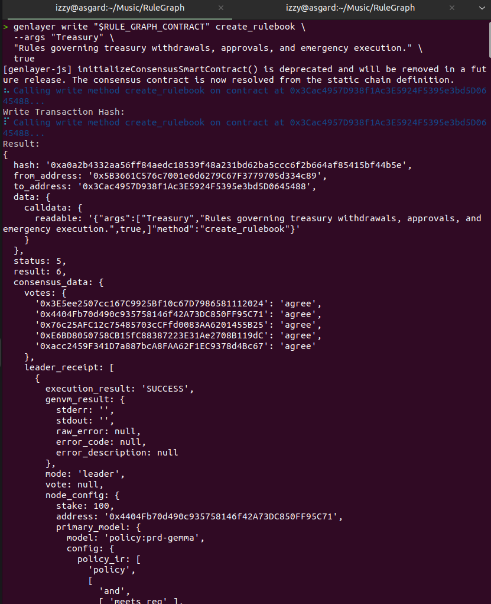<br><sub>Create rulebook on the current StudioNet deployment</sub></td>
<td align="center">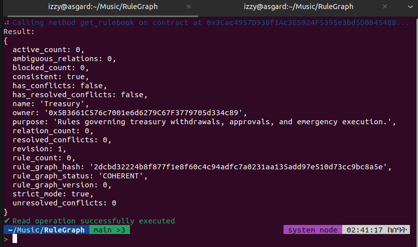<br><sub>Current rulebook readback</sub></td>
</tr>
<tr>
<td align="center">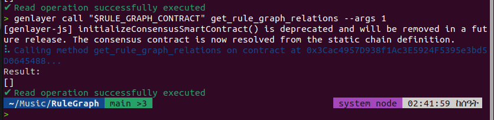<br><sub>Current active graph relations readback</sub></td>
<td align="center">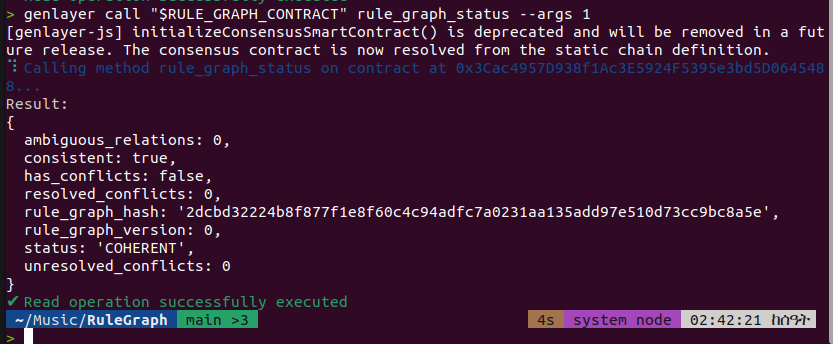<br><sub>Current rule graph status</sub></td>
</tr>
<tr>
<td align="center" colspan="2">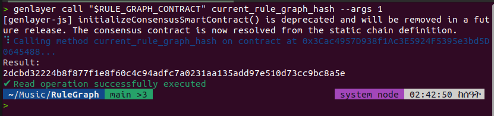<br><sub>Current rule graph hash</sub></td>
</tr>
</table>

### Historical complete lifecycle demo

<details>
<summary>Show the previous deployment's completed lifecycle</summary>

<table>
<tr>
<td align="center">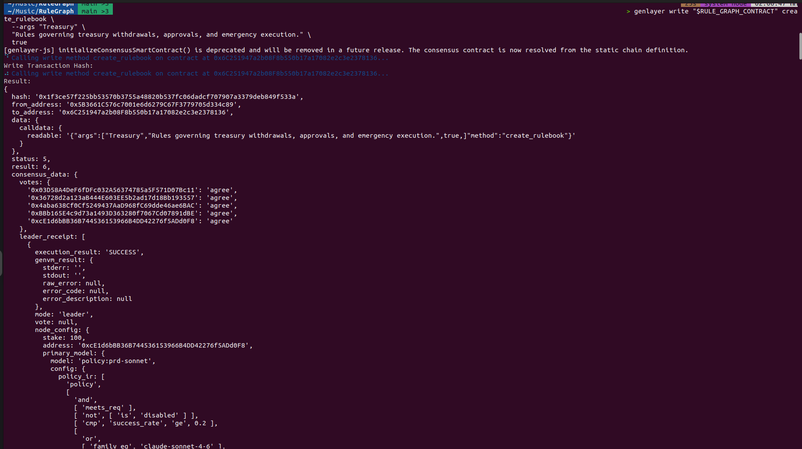<br><sub>Historical rulebook creation</sub></td>
<td align="center">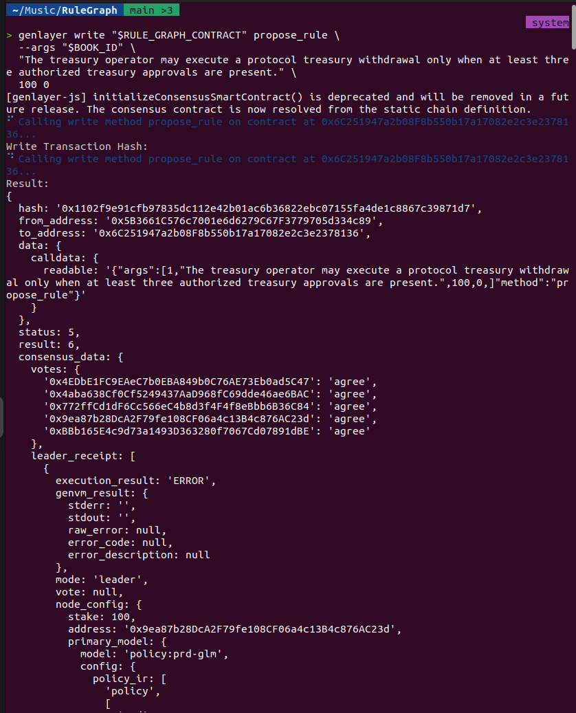<br><sub>Historical rule proposal and consensus</sub></td>
</tr>
<tr>
<td align="center">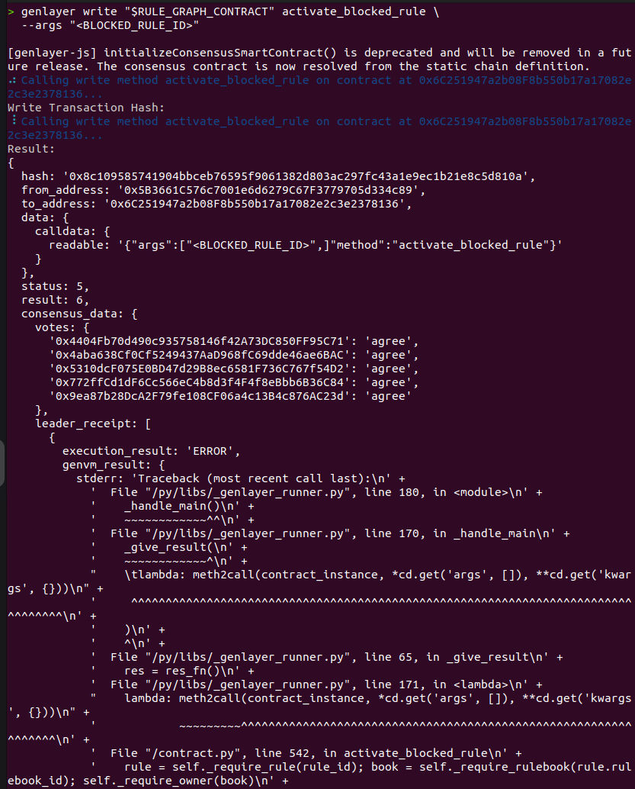<br><sub>Historical deterministic priority update</sub></td>
<td align="center">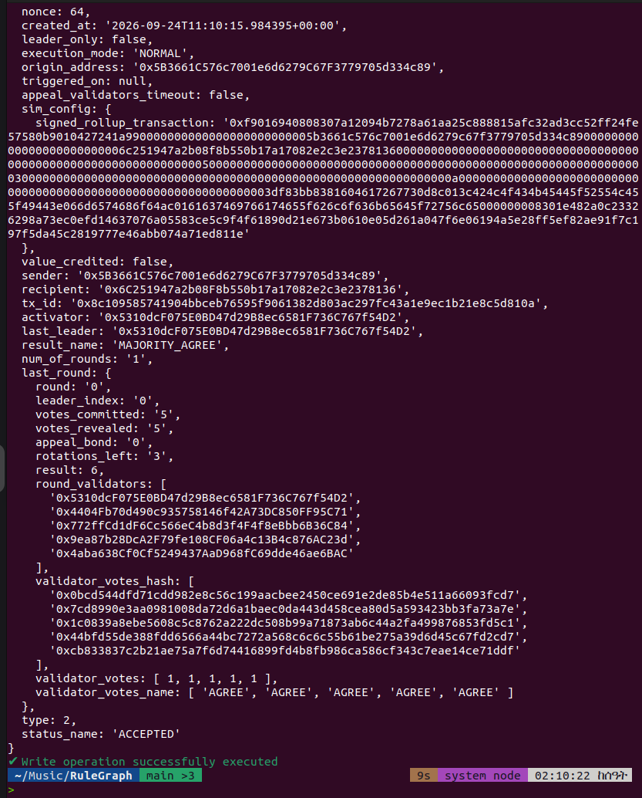<br><sub>Historical blocked-rule activation</sub></td>
</tr>
<tr>
<td align="center">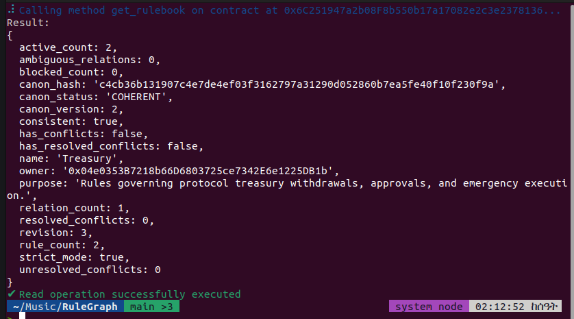<br><sub>Historical final rulebook readback</sub></td>
<td align="center">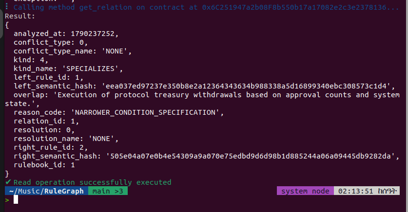<br><sub>Historical relation readback</sub></td>
</tr>
<tr>
<td align="center" colspan="2">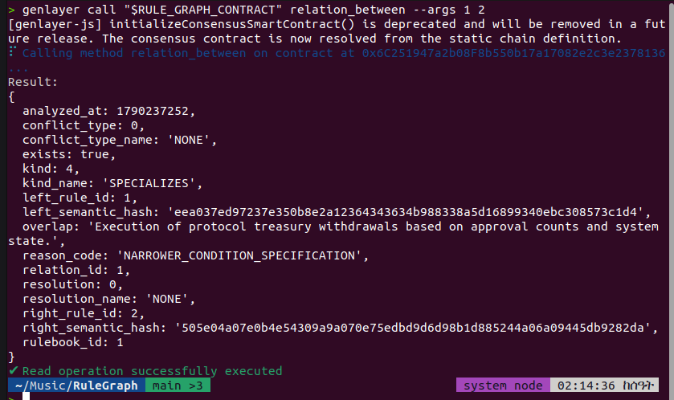<br><sub>Historical consistency check</sub></td>
</tr>
</table>

</details>

## Why this primitive exists

Traditional smart contracts are excellent when rules are already formalized. They are less useful when the authoritative rules are written in natural language and two questions must be answered before deterministic execution can proceed:

1. What does each rule materially require, permit, or prohibit?
2. Can the active rules coexist, and if not, which rule has protocol-level precedence?

The first question is semantic and is handled through GenLayer consensus.

The second is split deliberately:

- **semantic conflict detection** is consensus-backed;
- **precedence resolution** is deterministic contract logic.

That separation is a core design invariant. Validators are never asked to invent authority.

## Example

Suppose a treasury constitution contains:

> A treasury withdrawal must not execute when fewer than three approvals are present.

Later, an emergency amendment says:

> During an active exploit the security council may execute a withdrawal without three approvals.

The semantic layer can establish that the two rules conflict in the emergency-withdrawal overlap.

Rule_Graph does **not** ask an LLM which rule wins.

If both rules have equal priority, a strict rulebook blocks the new rule as an unresolved conflict.

If governance deliberately assigns the emergency rule a higher priority, deterministic state resolves the edge as `RIGHT_PREVAILS` and the rule_graph can remain consistent.

That distinction prevents an AI model from silently manufacturing constitutional hierarchy.

## State model

### Rulebook

A rulebook stores owner, name/purpose, strict mode, revision, rule_graph version, rule/relation IDs, counts, consistency, and a deterministic `rule_graph_hash`.

### Rule

Each rule stores immutable source text/hash, normalized modality, actor, action, object, condition, exception, scope, semantic clarity, semantic hash, priority, lifecycle status, version metadata, supersession lineage, and relation IDs.

A rule must represent one atomic normative proposition. Multi-clause or materially unclear text fails closed to `AMBIGUOUS` and cannot enter active rule_graph.

### Relation

Every live pair receives a persistent semantic edge:

- `UNRELATED`
- `COMPATIBLE`
- `REDUNDANT`
- `SPECIALIZES`
- `CONFLICT`
- `AMBIGUOUS`

Conflict edges also receive deterministic resolution:

- `LEFT_PREVAILS`
- `RIGHT_PREVAILS`
- `UNRESOLVED`

Relations store both semantic hashes so each edge is pinned to the exact interpretations compared.

## Consensus architecture

Rule_Graph has exactly two explicit custom consensus boundaries.

### 1. Rule normalization

The leader proposes a bounded semantic representation of one natural-language rule. The validator does **not** merely compare JSON shape: it independently checks whether the candidate is faithful, materially complete, conservative, atomic, and free from invented conditions, exceptions, scope, or authority.

### 2. Pairwise relation analysis

For every live historical rule in the same rulebook, the leader proposes the semantic relationship between the old node and the candidate. Validators independently verify that relationship against both immutable rule texts and both semantic records.

A leader cannot safely hide a real conflict by returning `COMPATIBLE`, because validators re-evaluate whether both rules can jointly be satisfied in their material overlap.

Both boundaries use `gl.vm.run_nondet_unsafe` with explicit validator functions.

See [`docs/CONSENSUS.md`](docs/CONSENSUS.md).

## Deterministic protocol mechanics

Once semantic facts are accepted, Rule_Graph uses deterministic state transitions for everything else.

### Priority

Priority is an explicit integer from `0` to `1000`. Larger values have stronger precedence.

If two active rules conflict:

- left priority > right priority -> `LEFT_PREVAILS`;
- right priority > left priority -> `RIGHT_PREVAILS`;
- equal priority -> `UNRESOLVED`.

The LLM never chooses the winner.

### Strict mode

In strict mode a candidate is blocked when its semantics are ambiguous, an active pairwise relation is ambiguous, a conflict has no deterministic precedence, or declared supersession is unrelated/ambiguous.

Blocked rules stay in history and in the graph but do not enter rule_graphical active state.

### Permissive mode

A permissive rulebook may admit a rule with unresolved conflict. The active rule_graph then exposes `consistent = false` and the exact unresolved edges remain queryable. A resolved conflict is different: `consistent = true`, `has_conflicts = true`, and `rule_graph_status = RESOLVED_CONFLICTS`.

### Blocked-rule recovery

A blocked rule can change **priority only**. Its text and semantic interpretation remain immutable. If the new priority resolves its conflicts, it can be activated without asking validators to reinterpret the rule.

### Supersession, repeal, restoration

Amendments are new immutable nodes. A declared replacement is semantically checked against its target before activation. Repeal never deletes history. A superseded rule can only be restored after its replacement becomes inactive and the graph shows it can safely re-enter rule_graph. Superseded nodes remain eligible for future pairwise comparison, so later rules cannot create a restoration-time missing edge. Restoration also checks blocked relations, preventing a known unresolved edge from being bypassed.

## Rule_Graph hash

The `rule_graph_hash` commits to active rules and active-active relation structure, including rule IDs, text hashes, semantic hashes, priorities, supersession targets, relation kinds, conflict subtypes, resolutions, and strict/permissive mode.

Downstream contracts can pin an exact coherent constitution:

```python
@gl.contract_interface
class IRule_Graph:
    class View:
        def is_consistent_for(self, rulebook_id: u256, expected_rule_graph_hash: str) -> bool: ...
```

A consumer can fail closed if the rulebook changed or became inconsistent.

## Public methods

Writes:

- `create_rulebook(name, purpose, strict_mode=True)`
- `propose_rule(rulebook_id, text, priority=100, supersedes_rule_id=0)`
- `set_blocked_rule_priority(rule_id, priority)`
- `activate_blocked_rule(rule_id)`
- `repeal_rule(rule_id)`
- `restore_superseded_rule(rule_id)`

Views:

- `get_rulebook(rulebook_id)`
- `get_rule(rule_id)`
- `get_relation(relation_id)`
- `relation_between(left_rule_id, right_rule_id)`
- `get_rule_graph(rulebook_id)`
- `get_rule_graph_relations(rulebook_id)`
- `rule_graph_status(rulebook_id)`
- `blocking_reason(rule_id)`
- `is_consistent(rulebook_id)`
- `is_consistent_for(rulebook_id, expected_rule_graph_hash)`
- `current_rule_graph_hash(rulebook_id)`

## Cross-contract use cases

Rule_Graph can sit underneath DAO constitutions, treasury governance, autonomous-agent mandates, marketplace rulebooks, insurance policy stacks, procurement policies, protocol emergency procedures, compliance rule sets, and multi-party operating agreements.

See [`docs/INTEGRATION.md`](docs/INTEGRATION.md).

## Why this is not a thin LLM wrapper

The model cannot directly mutate arbitrary state and cannot choose precedence. The contract provides the protocol:

1. create a bounded rulebook;
2. freeze candidate text;
3. consensus-normalize the rule;
4. consensus-create pairwise semantic edges;
5. deterministic precedence resolution;
6. strict-mode rule_graph gating;
7. persistent blocked/history nodes;
8. supersession and repeal lineage;
9. hashed rule_graphical state for consumers;
10. later rules compare against older active, blocked, and restorable superseded nodes.

The valuable output is the accumulated graph and rule_graphical state, not generated prose.

## Bounded cost

Pairwise semantic analysis is intentionally bounded to **24 rules per rulebook**. The maximum unique graph size is `24 * 23 / 2 = 276` edges, and adding the 24th node requires at most 23 new comparisons. The same global bound applies when restorable superseded nodes are retained for graph completeness. Large organizations should partition rules into coherent rulebooks instead of creating one unbounded policy graph.

## Security model

Key properties include untrusted-data prompt boundaries, bounded/rule_graphicalized outputs, substantive validator review, fail-closed ambiguity, model-independent authority, immutable active priority, immutable semantic history, semantic-hash-pinned edges, strict blocked-rule admission, rule_graph hash pinning, and retained repeal/supersession history.

See [`docs/THREAT_MODEL.md`](docs/THREAT_MODEL.md).

## Repository layout

```text
contracts/rule_graph.py
tests/test_rule_graph.py
scripts/preflight.py
docs/ARCHITECTURE.md
docs/CONSENSUS.md
docs/INTEGRATION.md
docs/THREAT_MODEL.md
SUBMISSION.md
DEPLOYMENT.md
```

There is intentionally no frontend directory.

## Testing

Offline preflight:

```bash
python scripts/preflight.py
```

Current repository preflight result at creation:

```text
Rule_Graph offline preflight: 14/14 checks passed
```

GenLayer Direct Mode:

```bash
python -m pip install -r requirements-dev.txt
gltest tests/test_rule_graph.py -v -s
```

`tests/test_rule_graph.py` contains 49 Direct Mode scenarios covering independent validator derivation, symmetric semantic-state convergence, malicious disagreement, lifecycle, malformed outputs, prompt-injection behavior, multi-conflict precedence, blocked-rule graph enrichment, nested supersession/restoration safety, rule_graph status/pinning, and the 24-rule bound.

## Deployment

Rule_Graph has no constructor arguments.

```bash
npm install -g genlayer
genlayer network set studionet
genlayer account show
genlayer deploy --contract contracts/rule_graph.py
```

See [`DEPLOYMENT.md`](DEPLOYMENT.md) for the verification sequence. A live address is only recorded after actual finalization.

## GenLayer references

- https://docs.genlayer.com/developers/intelligent-contracts/introduction
- https://docs.genlayer.com/developers/intelligent-contracts/equivalence-principle
- https://docs.genlayer.com/developers/intelligent-contracts/storage
- https://docs.genlayer.com/developers/intelligent-contracts/deploying/cli-deployment
- https://docs.genlayer.com/api-references/genlayer-test

## License

MIT
